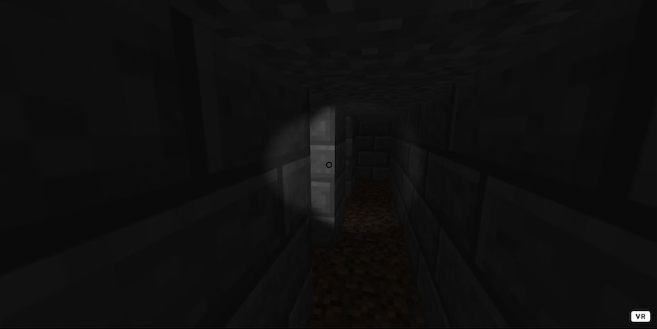

After releasing my [rogue](https://github.com/oliviernocent/rogue) project, I wanted to explore A-Frame, the virtual reality web framework. So here comes **Death Maze**, a scary 3D version of
[a-mazing](https://github.com/oliviernocent/a-mazing).

Try the live [demo](https://oliviernocent.github.io/deathmaze/).

---

Credits: [Etienne Coutant](https://iut-info.univ-reims.fr/users/coutant/Creation_Resolution_Labyrinthe_Sujet.html)
